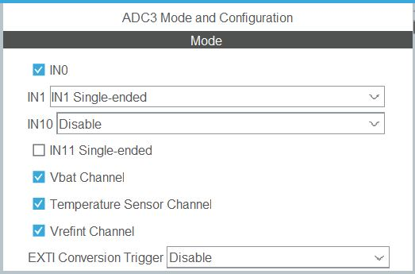
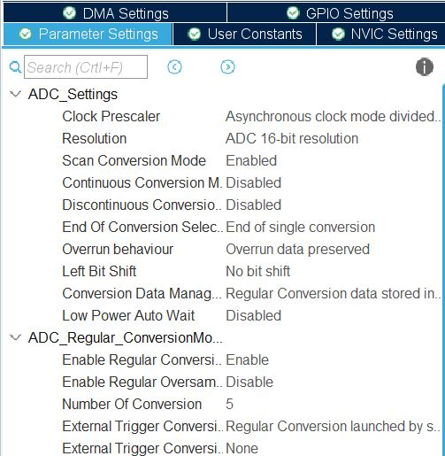
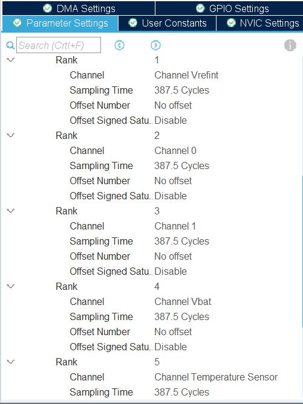
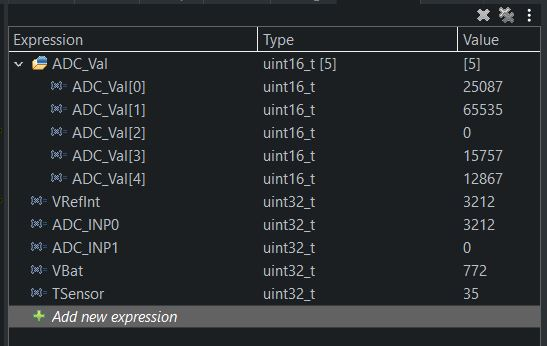
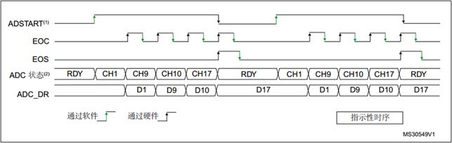

<h1>STM32H7 ADC Multi Channel Single Conversion Polling Mode</h1>

<p>Tested with STM32H750 in HAL & LL library, should be able ported to others<p>

This example will convert several channels. ADC conversions are performed successively in a scan sequence.  
Software polls for conversion completion

Setup ADC3 to measure 2 channel(INP0 & INP1) & 3 internal channel(VRefInt, VBat & TempSensor)



Disable Discontinuous conversion for burst conversion
Disable continuous conversion for single conversion
End of conversion selection set to "End of Single Conversion"



Since this example is not for speed, we set long sampling time.  
The Rank Setting:



ADC value is convert to voltage/temperature with build in macro  
The Output in Live Expression:



HAL library is quite straight forward and simple, while LL took me some time to make it run.  
Few command that had cause me some time to figure out after reference to other example in forum.

```c
  LL_ADC_SetChannelPreSelection(ADC3, LL_ADC_CHANNEL_VREFINT);
  LL_ADC_SetChannelPreSelection(ADC3, LL_ADC_CHANNEL_0);
  LL_ADC_SetChannelPreSelection(ADC3, LL_ADC_CHANNEL_1);
  LL_ADC_SetChannelPreSelection(ADC3, LL_ADC_CHANNEL_VBAT);
  LL_ADC_SetChannelPreSelection(ADC3, LL_ADC_CHANNEL_TEMPSENSOR);
```
```c
  LL_ADC_SetCommonPathInternalCh(__LL_ADC_COMMON_INSTANCE(ADC3),
		  LL_ADC_CHANNEL_VREFINT | LL_ADC_CHANNEL_VBAT |
		  LL_ADC_CHANNEL_TEMPSENSOR);
``` 

Using HAL library to do multi channel single conversion seem straigth forward.
But if reverse the HAL code to LL seem not workable.

After read numerous online forum and tutorial, 
i found this to explain how to do multi channel single conversion without mixed reading.

It's say after each channel conversion there will be a EOC flag,
That mean we had to poll for EOC instead of EOS.
If we poll for EOS, we will be fall into infinite loop due to EOS flag only will trigger after we read the first data.
This has been discuss in [Here](https://community.st.com/s/question/0D53W00000ORPhH/stm32h743-adc1-eos-flag-will-not-be-set-until-i-read-the-dr)



Source [Link](https://www.programmersought.com/article/85163871202/)
<p>Comment/Suggestion are highly welcome!</p>